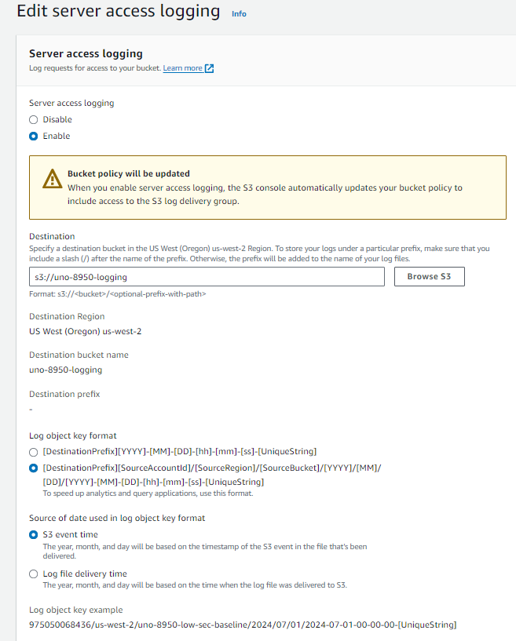
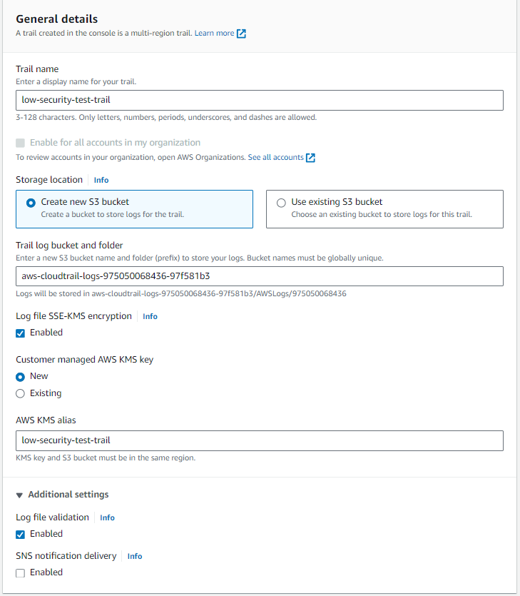

Below are instructions for implementing controls in S3 found within the "AU Audit and Accountability" category of NIST 800-53. 

# AU-2, AU-3, AU-3(1), AU-8, AU-12, AU-12(1), AU-12(3)

## Server Access Logging:

In order to hold the logs we will need to create a new logging bucket. Within this bucket we can navigate to the properties tab. On the Server Access Logging section we can choose edit then enable. Once in select your new logs bucket from the “Browse S3” option. Then select the “[DestinationPrefix][SourceAccountId]/​[SourceRegion]/​[SourceBucket]/​[YYYY]/​[MM]/​[DD]/​[YYYY]-[MM]-[DD]-[hh]-[mm]-[ss]-[UniqueString]” option and ensure logs are created based on event time. If done correctly it should look like this. 

## Testing Server Access Logging

In the chosen bucket begin making changes by making any server accesses. 

Navigate to the logging bucket and confirm that logs have been created that correlate to the changes made. 

## Cloud Trail
Navigate to the properties tab in your desired bucket.

Open the CloudTrail tab and select the trails tab

Create a new trail and choose a name

Either create a new logging bucket or use an existing S3 bucket designated for logging.

Create a new name for your new KMS key or choose an existing KMS key from the drop down

Navigate to the next page
On the next page select Management Events, Data Events, and Insight Events

.png)

Under Data Events choose S3 from the drop down and log all events from the next drop down

Under Insight Events select API Call Rate

.png)
