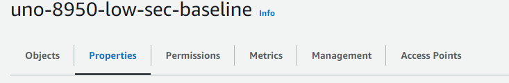

Below are instructions for implementing controls in S3 found within the "AU Audit and Accountability" category of NIST 800-53. 

# AU-2, AU-3, AU-3(1), AU-8, AU-12, AU-12(1), AU-12(3)

Server Access Logging:

Create a new logging bucket. 
In your bucket navigate to the properties tab

Find “Server Access Logging” and choose edit, then enable. 
Once in select your new logs bucket from the “Browse S3” option
Then select the “[DestinationPrefix][SourceAccountId]/​[SourceRegion]/​[SourceBucket]/​[YYYY]/​[MM]/​[DD]/​[YYYY]-[MM]-[DD]-[hh]-[mm]-[ss]-[UniqueString]” option and ensure logs are created based on event time. 
If done correctly it should look like this. 

