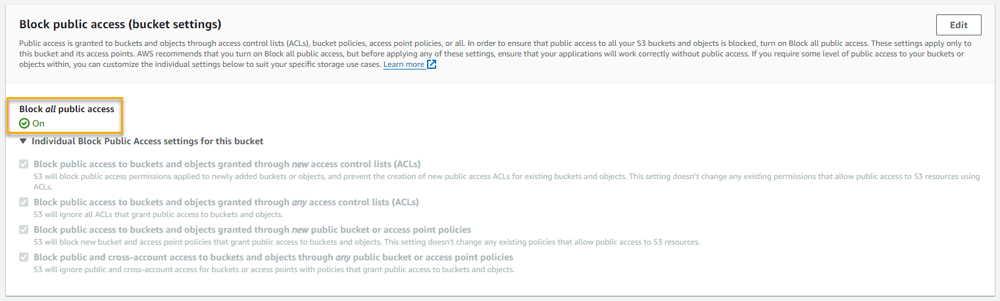

Below are instructions for implementing controls in S3 found within the "CA Assessment, Authorization, and Monitoring" category of NIST 800-53. 

## CA-9 - Internal System Connections
The CA-9 control reads: 
> Authorize internal connections of [organization-defined system components or classes of components] to the system;

In order to restrict connections to the S3 bucket from only internal sources, we can turn on the "Block Public Access" setting from within the S3 settings page. 

Doing this means that any external connections to the bucket would be blocked. This sort of configuration is appropriate for high and potentially medium-security baseline configurations. It would not be appropriate for low-security configurations that require public access for hosting files publicly. 
