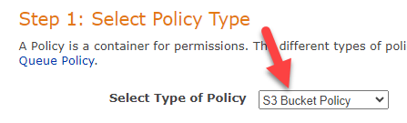
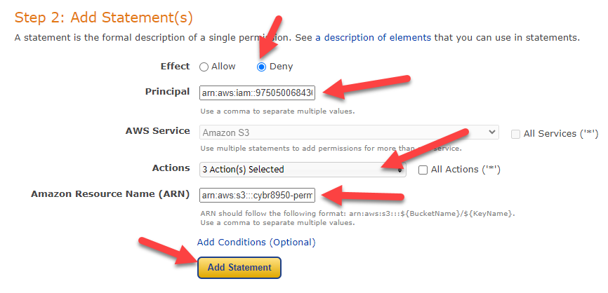
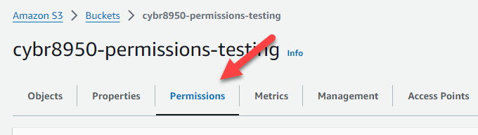
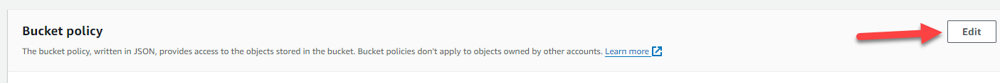
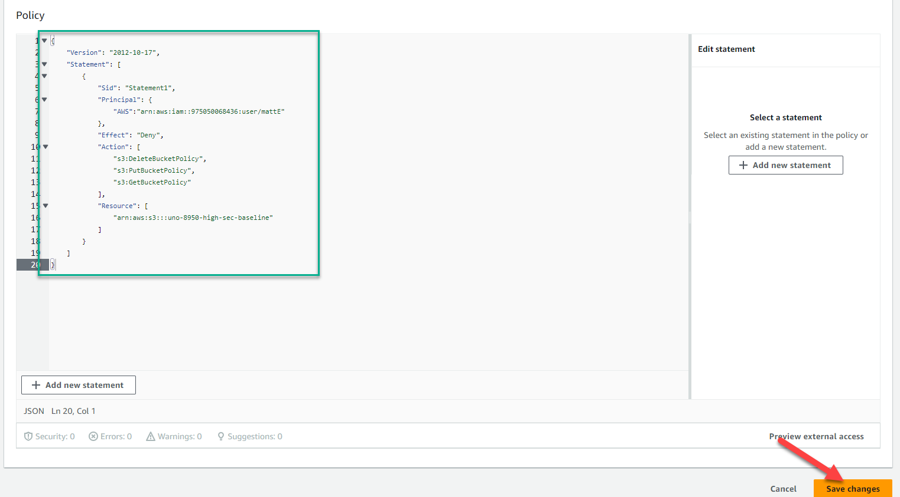

Below are instructions for implementing controls in S3 found within the "CM Configuration Management" category of NIST 800-53.

# CM-5 - Access Restrictions for Change
CM-5, Access Restrictions for Change reads: 
> Define, document, approve, and enforce physical and logical access restrictions associated with changes to the system.

This control deals with the limiting of administrators and privileged users who have the ability to make changes to physical or logical access. In this case, only logical access is at play since the resources are in the cloud.

## Implementing CM-5
Bucket policies are a feature of S3 buckets in AWS that allow you to grant or restrict access to S3 buckets, and they can even apply down to the object level within buckets. 

In order to restrict access to administrative-level actions on an S3 bucket, you would want to restrict the ability to modify or remove bucket policies and ACLs. There are AWS "Actions" that correspond to those three administrative actions. We can write a bucket policy which has an "Allow" effect for specified principals (AWS users). 

In order to more easily write up a bucket policy to block access to the bucket policy for certain administrators, we can use the AWS policy generator tool. The tool can be found here: https://awspolicygen.s3.amazonaws.com/policygen.html

Once on the policy generator page, we select "S3" as the policy type. 



Next, select "Deny" as the intended effect of this policy statement. You will need to fill in the Principal (the administrator account ARN(s) that you would like to deny access to), and select the below three options from the "Actions" dropdown: 
- DeleteBucketPolicy
- GetBucketPolicy
- PutBucketPolicy

Click "Add Statement" at the bottom in order to add that policy statement. 



In this case, we only need to add one statement. So, we are able to click "Generate Policy" at the bottom. This will generate the policy for us, and you can copy that policy right out of the generator and keep it handy for the next steps. 

Below is an example of a policy that applies to a single AWS IAM user and allows that user to modify the bucket policies (and therefore the settings of the bucket itself). 

```
{
	"Version": "2012-10-17",
	"Statement": [
		{
			"Sid": "Statement1",
			"Principal": {
			    "AWS":"arn:aws:iam::975050068436:user/mattE"
			},
			"Effect": "Deny",
			"Action": [
				"s3:DeleteBucketPolicy",
				"s3:PutBucketPolicy",
				"s3:GetBucketPolicy"
			],
			"Resource": [
				"arn:aws:s3:::uno-8950-high-sec-baseline"
			]
		}
	]
}
```

Now, open up the bucket you intend to apply this policy to. Click on the "Permissions" tab to bring up the permissions page, where the bucket policy is located. 



Find the Bucket policy section, and click the "Edit" button. 



Copy and paste the policy into the Policy section of the page, and click "Save changes" at the bottom. 



You have successfully denied access to the selected administrators to edit or remove the bucket policy. 

## Testing CM-5
In order to test this control, we need to attempt to make changes to the bucket policy as one of the users (principals) listed in the principal list in the above policy, and as a user not listed in the principal list. We would expect that the user in the principal list could edit the policy, while the user not in the principal list could not edit the policy. 
