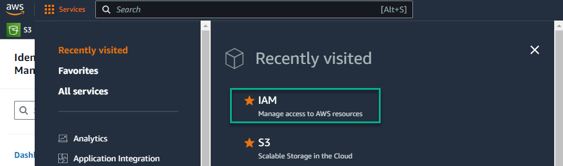

Below are instructions for implementing controls in S3 found within the "IA Identification and Authentication" category of NIST 800-53.

# IA-2 - Internal System Connections
## Implementing IA-2 Identification and Authentication (organizational Users)
NIST 800-53 control IA-2 reads: 
> Uniquely identify and authenticate organizational users and associate that unique identification with processes acting on behalf of those users.

When looking at an S3 bucket, the primary means of enforcing authentication is to utilize the built-in AWS authentication mechanisms. User management is done through the IAM (Identity and Access Management) console from within the AWS Console. After logging in to the AWS console, you can select "IAM" from the list of AWS services. 

## Implementing IA-2(1) Multi-factor Authentication to Privileged Accounts
