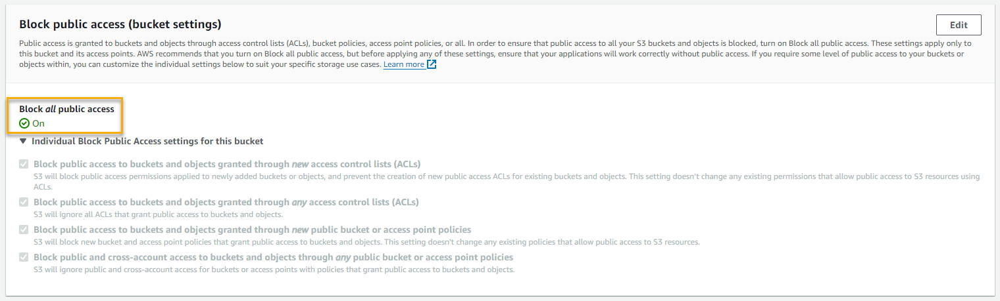
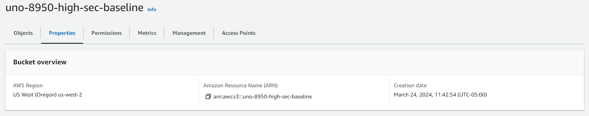

Below are instructions for implementing controls in S3 to block public access to data. 

# Restricting Public Access to Data and Buckets
## Restricting Public Access
The CA-9 control reads: 
> Authorize internal connections of [organization-defined system components or classes of components] to the system;

In order to restrict connections to the S3 bucket from only internal sources, we can turn on the "Block Public Access" setting from within the S3 settings page. 

Doing this means that any external connections to the bucket would be blocked. This sort of configuration is appropriate for high and potentially medium-security baseline configurations. It would not be appropriate for low-security configurations that require public access for hosting files publicly. 

## Testing Public Access Restrictions
In order to test CA-9, we first need to confirm that the bucket is not accessible publicly. We can verify this by logging into the AWS S3 console and going to the properties of the bucket in question. In the "Bucket overview" section we see that there is no public URL listed. This indicates that the bucket is not accessible publicly. 

