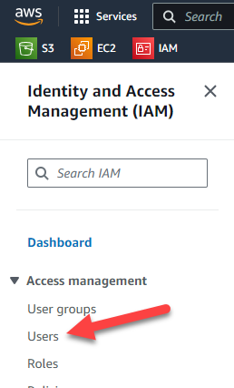

Below are instructions for implementing controls surrounding identification and authentication in AWS/S3.

## Implementing Identification and Authentication in AWS
NIST 800-53 control IA-2 reads: 
> Uniquely identify and authenticate organizational users and associate that unique identification with processes acting on behalf of those users.

When looking at an S3 bucket, the primary means of enforcing authentication is to utilize the built-in AWS authentication mechanisms. User management is done through the IAM (Identity and Access Management) console from within the AWS Console. After logging in to the AWS console, you can select "IAM" from the list of AWS services. 

## Implementing Multi-factor Authentication on AWS Accounts
NIST 800-53 IA-2(1) reads: 
> Implement multi-factor authentication for access to privileged accounts.

And IA-2(2) reads: 
> Implement multi-factor authentication for access to privileged accounts.

To enable multi-factor authentication on an account in AWS, you first need to navigate to the IAM menu. Once you're there, click on "Users" on the left side in the menu. 

Next, click on the name of the user you wish to implement MFA for. Click on the "Security credentials" tab. 

Click on "Assign MFA device" and follow the prompts to set up either a virtual authenticator app (such as Google Authenticate) or a physical FIDO device (such as a Yubikey). 

Once that has been completed, MFA is enabled for that user. 

## Testing Multi-factor Authentication
