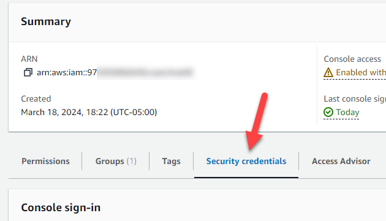
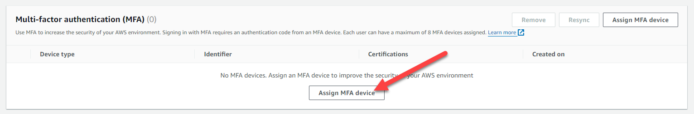

# Project Purpose
Cloud providers like Azure, Google, and AWS have changed the way organizations build out their infrastructure. By nature, the cloud tends to be more "open" due to the fact that it is operating on shared hardware owned by someone else (the cloud provider). This can present risks, though. One of the risks that has been widely publicized is that of overly permissive S3 buckets in AWS. There are plenty of news stories about data being leaked via an S3 bucket that was publicly shared unintentionally. These misconfigurations can lead to lawsuits, bad press, and other negative outcomes for businesses. There is a need for more detailed baselines for S3 buckets in order to minimize sensitive data leakage.

The S3 Baseline Project aims to fix that problem of misconfigured S3 buckets leaking sensitive data by providing actionable baselines which security professionals and cloud administrators can use to secure their S3 buckets. The goals of this project are: 
- Provide actionable baseline for administrators to aid in securing S3 buckets
- Meet the needs of various verticals by providing tailored baselines for different needs
  - Banks may need more stringent configurations to ensure NO sensitive data is leaked
  - Retail organizations may need moderately stringent configurations to minimize sensitive data leakage but still allow sharing of information publicly as needed
  - Certain media outlets or other oganizations may need very little configuration due to the majority of data being published publicly anyway
- Test each level of baseline provided above against reasonable attack vectors against S3 buckets to provide some assurance that the framework provides value

Organizations of all sizes would be able to benefit from having detailed baselines like those proposed above, in order to assist them in securing S3 buckets. Smaller organizations with less in-house cloud expertise would likely benefit most from these baselines, though. Having a proven baseline to guide the setup and configuration of S3 buckets would make it easier for organizations of any size to safely utilize cloud resources like S3 buckets.

# Framework Alignment and Control Family Applicability
The NIST 800-53 framework provides a list of 20 control families. The contributors to this project selected 10 control families that are applicable to S3 buckets. The list of applicable control families is below. 
- AC Access Control
- AT Awareness and Training
- AU Audit and Accountability
- CA Assessment, Authorization, and Monitoring
- CM Configuration Management
- CP Contingency Planning
- IA Identification and Authentication
- MP Media Protection
- SC System and Communications Protection
- SI System and Information Integrity

Not every individual control within each of the above control families is applicable. In fact, most are, by nature of AWS and S3, not applicable. The below sections (organized by control family) provide a list of the applicable controls within that family, and link to documentation on how to implement settings within S3 that satisfy each control. 

# AC Access Control

# AT Awareness and Training

# AU Audit and Accountability

# CA Assessment, Authorization, and Monitoring
The CA family of controls deals with assessing the environment and access, authorizing access, and monitoring. The applicable control for S3 buckets is below: 
- CA-9

## Restricting Public Access to S3 Buckets
NIST 800-53 control CA-9 reads: 
> Authorize internal connections of [organization-defined system components or classes of components] to the system;

In order to restrict connections to the S3 bucket from only internal sources, we can turn on the "Block Public Access" setting from within the S3 settings page. 


Doing this means that any external connections to the bucket would be blocked. This sort of configuration is appropriate for high and potentially medium-security baseline configurations. It would not be appropriate for low-security configurations that require public access for hosting files publicly.

## Testing Public Access Restrictions
In order to test CA-9, we first need to confirm that the bucket is not accessible publicly. We can verify this by logging into the AWS S3 console and going to the properties of the bucket in question. In the "Bucket overview" section we see that there is no public URL listed. This indicates that the bucket is not accessible publicly. 


# CM Configuration Management
The CM family of controls deals with managing the configuration of information systems. For S3 buckets, the below control is applicable: 
- CM-5

## Restricting Administrator Permissions in S3
NIST 800-53 control CM-5 reads: 
> Define, document, approve, and enforce physical and logical access restrictions associated with changes to the system.

This control deals with the limiting of administrators and privileged users who have the ability to make changes to physical or logical access. In this case, only logical access is at play since the resources are in the cloud.

## Setting up a Bucket Policy to Limit Administrator Permissions
Bucket policies are a feature of S3 buckets in AWS that allow you to grant or restrict access to S3 buckets, and they can even apply down to the object level within buckets.

In order to restrict access to administrative-level actions on an S3 bucket, you would want to restrict the ability to modify or remove bucket policies and ACLs. There are AWS "Actions" that correspond to those three administrative actions. We can write a bucket policy which has an "Allow" effect for specified principals (AWS users).

In order to more easily write up a bucket policy to block access to the bucket policy for certain administrators, we can use the AWS policy generator tool. The tool can be found here: https://awspolicygen.s3.amazonaws.com/policygen.html

Once on the policy generator page, we select "S3" as the policy type. 


Next, select "Deny" as the intended effect of this policy statement. You will need to fill in the Principal (the administrator account ARN(s) that you would like to deny access to), and select the below three options from the "Actions" dropdown:

- DeleteBucketPolicy
- GetBucketPolicy
- PutBucketPolicy

Click "Add Statement" at the bottom in order to add that policy statement.


In this case, we only need to add one statement. So, we are able to click "Generate Policy" at the bottom. This will generate the policy for us, and you can copy that policy right out of the generator and keep it handy for the next steps.

Below is an example of a policy that applies to a single AWS IAM user and allows that user to modify the bucket policies (and therefore the settings of the bucket itself).

```
{
	"Version": "2012-10-17",
	"Statement": [
		{
			"Sid": "Statement1",
			"Principal": {
			    "AWS":"arn:aws:iam::975050068436:user/mattE"
			},
			"Effect": "Deny",
			"Action": [
				"s3:DeleteBucketPolicy",
				"s3:PutBucketPolicy",
				"s3:GetBucketPolicy"
			],
			"Resource": [
				"arn:aws:s3:::uno-8950-high-sec-baseline"
			]
		}
	]
}
```

Now, open up the bucket you intend to apply this policy to. Click on the "Permissions" tab to bring up the permissions page, where the bucket policy is located. 


Find the Bucket policy section, and click the "Edit" button. 


Copy and paste the policy into the Policy section of the page, and click "Save changes" at the bottom.


You have successfully denied access to the selected administrators to edit or remove the bucket policy.

## Testing Administrator Permissions Restrictions
In order to test this control, we need to attempt to make changes to the bucket policy as one of the users (principals) listed in the principal list in the above policy, and as a user not listed in the principal list. We would expect that the user in the principal list could edit the policy, while the user not in the principal list could not edit the policy.

If, as a principal of an administrator who was denied access to edit the bucket policy (as seen above) we try and access the bucket policy page, we should see the below error message if the access is correctly blocked.


If we are able to see the bucket policy (and no error message is shown like the one above), the control is not in place.

# CP Contingency Planning

# IA Identification and Authentication
## IA-2 Identification and Authentication (organizational Users)
Identifying individual users and authenticating those users so that you can restrict access and assign permissions appropriately is crucial. For S3 buckets, the below controls are applicable: 
- IA-2
- IA-2(1)
- IA-2(2)

NIST 800-53 control IA-2 reads: 
> Uniquely identify and authenticate organizational users and associate that unique identification with processes acting on behalf of those users.

When looking at an S3 bucket, the primary means of enforcing authentication is to utilize the built-in AWS authentication mechanisms. User management is done through the IAM (Identity and Access Management) console from within the AWS Console. After logging in to the AWS console, you can select "IAM" from the list of AWS services. 


## Implementing Multi-factor Authentication on AWS Accounts
NIST 800-53 IA-2(1) reads: 
> Implement multi-factor authentication for access to privileged accounts.

And IA-2(2) reads: 
> Implement multi-factor authentication for access to privileged accounts.

To enable multi-factor authentication on an account in AWS, you first need to navigate to the IAM menu. Once you're there, click on "Users" on the left side in the menu. 


Next, click on the name of the user you wish to implement MFA for. Click on the "Security credentials" tab. 



Click on "Assign MFA device" and follow the prompts to set up either a virtual authenticator app (such as Google Authenticate) or a physical FIDO device (such as a Yubikey). 



Once that has been completed, MFA is enabled for that user. 

## Testing Multi-factor Authentication


# MP Media Protection
The MP family of controls deals with protecting information stored on various forms of media, such as digital, physical, or portable media. Because S3 buckets are a cloud-based storage solution provided by Amazon Web Services (AWS), and they operate within a different context compared to traditional physical or digital media, this control family is not applicable.

# SC System and Communications Protection
The System and Communications Protection control focuses on safeguarding the integrity, confidentiality, and availability of information systems and communications. For S3 Buckets here are the controls that apply:
- SC-5
- SC-8(1)
- SC-12
- SC-13
- SC-28
- SC-28(1)

## AWS S3 bucket Denial of Service Protection (Implementing AWS Shield)
NIST 800-53 control SC-5 reads:
> Restrict the ability of individuals to launch the following denial-of-service attacks against other systems

**Sign in to the AWS Management Console**: Go to the [AWS Management Console](https://console.aws.amazon.com/). 

**Navigate to AWS Shield**: In the AWS Management Console, use the search bar or navigate to the "Security, Identity, & Compliance" section and click on "Shield" under "Security."


**Choose AWS Shield Advanced (optional)**: AWS shield offers two shield services standard and advanced. If an organization require additional protection and features beyond the basic protection offered by AWS Shield Standard, they can subscribe to AWS Shield Advanced. This includes advanced DDoS protection and 24/7 access to the AWS DDoS Response Team (DRT). Something to note is that AWS Shield Standard is automatically enabled for all AWS customers at no extra cost. 


**Enable AWS Shield on Amazon S3**: If using AWS Shield Advanced, follow the instructions provided in the AWS Shield console to enable the service for your Amazon S3 buckets.


To specifically enable the shield for a specific S3 bucket press on add resources to protect and select your bucket and configure the desired protection settings. You can then see what services AWS shield advanced are serving.

  

**Review Protection Settings**: Once AWS Shield is enabled for the S3 buckets, review and configure the protection settings as needed like setting up mitigation preferences, configuring advanced protection features, and defining notification preferences for DDoS events. [AWS Shield advanced update](https://aws.amazon.com/blogs/aws/aws-shield-advanced-update-automatic-application-layer-ddos-mitigation/).


**Monitor DDoS Events**: AWS Shield provides visibility into DDoS events and alerts through the AWS Management Console, CloudWatch alarms, and Amazon S3 access logs. It is good practice to monitor these channels regularly to stay informed about any DDoS activity targeting the S3 buckets and take appropriate action as necessary.[AWS Shield advanced update](https://aws.amazon.com/blogs/aws/aws-shield-advanced-update-automatic-application-layer-ddos-mitigation/).

## Enabling Server-Side Encryption (SSE) and Key Management Service (KMS) for AWS S3 buckets
NIST 800-53 control SC-8,12,13,28 and 28(1) read:
> - Protecting the confidentiality and integrity of transmitted information
> - Establish and manage cryptographic keys when cryptography is employed within the system in accordance with key management requirements
> - Cryptographic Protection
> - Protect the information at rest
> - Implement cryptographic mechanisms to prevent unauthorized disclosure and modification of information at rest

These controls focus on establishing and managing cryptographic keys used for encryption and decryption to protect sensitive information during transmission, storage or archived. Overall, implementing these controls help establish robust cryptographic systems, secure data transmission and storage, and mitigate the risks associated with unauthorized access or disclosure of sensitive information.

 **Sign in to the AWS Management Console**: Go to the [AWS Management Console](https://console.aws.amazon.com/).

 **Navigate to Amazon S3**: From the list of AWS services, select "S3" to access the Amazon S3 dashboard.

 


 **Select the S3 Bucket**: Click on the name of the S3 bucket for which you want to enable server-side encryption.

 **Configure Bucket Properties**: Once the bucket is selected , click on the "Properties" tab.


 **Enable Server-Side Encryption**: Scroll down to the "Default encryption" section and click on it to expand the options.

 


 **Choose Encryption Type**: Select the encryption type you want to use for server-side encryption. There are three options available:

    - Server-side encryption with Amazon S3 managed keys (SSE-S3): This is Amazon S3-managed encryption, where AWS automatically handles the encryption and decryption of your objects using Advanced Encryption Standard (AES) with 256-bit keys.

    - Server-side encryption with AWS Key Management Service keys (SSE-KMS): This option allows you to use AWS Key Management Service (KMS) to manage encryption keys. SSE-KMS provides additional control and auditing capabilities, allowing you to create and manage keys and define access policies.

    - Dual-layer server-side encryption with AWS Key Management Service keys (DSSE-KMS): Amazon S3 applies two individual layers of object-level encryption to satisfy compliance requirements for highly regulated customers.


 **Save Changes**: After selecting the desired encryption type, click "Save" to apply the encryption settings to the bucket.

 **Access Control List (ACL)**: Ensure that the bucket's ACL settings are configured to allow only authorized users and applications to access the bucket. This helps prevent unauthorized access to the encrypted data.

 **Upload Encrypted Data**: Upload objects to the S3 bucket as usual. Amazon S3 automatically encrypts these objects using the specified server-side encryption method.


# SI System and Information Integrity
